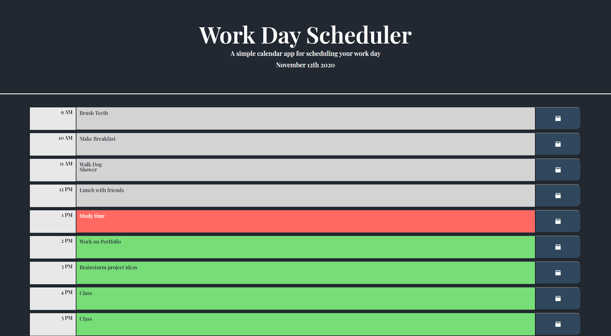

# Work Day Scheduler

## Table of Contents
* [Purpose](#purpose)
* [Instructions](#instructions)
* [Features](#features)
* [Website](#website)
* [Contributions](#contributions)

## Purpose
* This is a simple work day sceduler that will allow you to schedule your day from 9 to 5

##  Instructions
* When page loads, you can edit your schedule accordingly. When you type in a task for the hour, make sure to press the save button for that hour or your schedule will not be saved! Hours are color coded according to what is due the hour you are in, what is past due and the future. At the end of the day, dont worry about deleting all of your tasks for the new day, the application will do it for you!

## Features
* Local storage that will save a users tasks
* Moment JS that will color code hours, show the current date, and reset the users local storage for the new day

## Website

[Deployed Application Link](https://ajcuddeback.github.io/work-day-scheduler)

## Contributions
* Starting Code provided by [UCF Coding Bootcamp](https://github.com/coding-boot-camp/super-disco)
* Jquery, bootstrap, and added styles by Austin Cuddeback